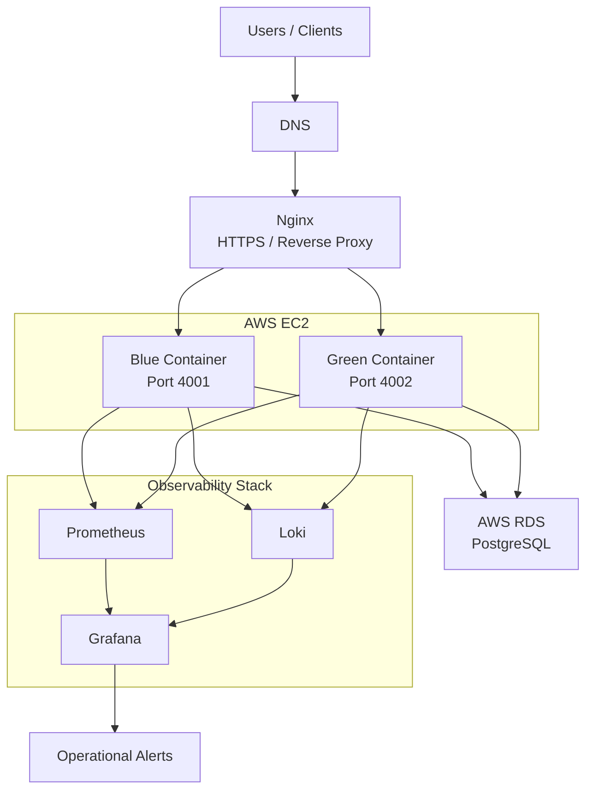
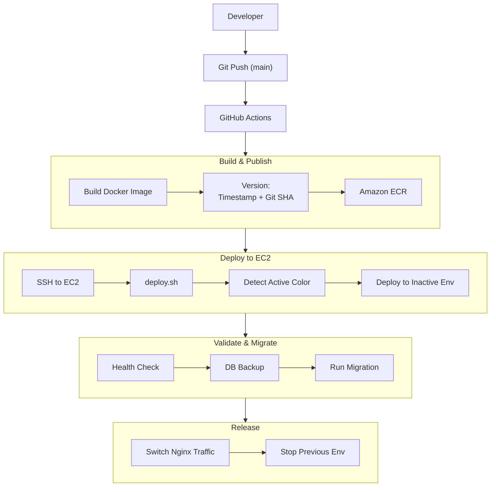
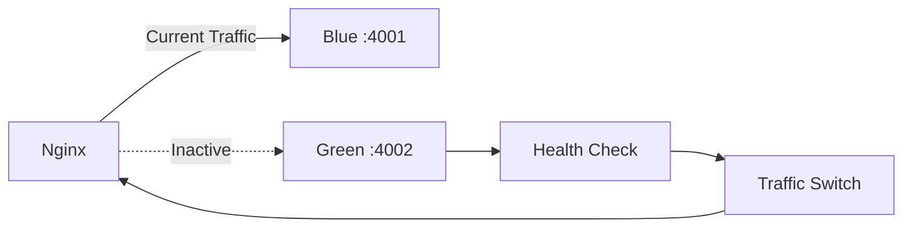
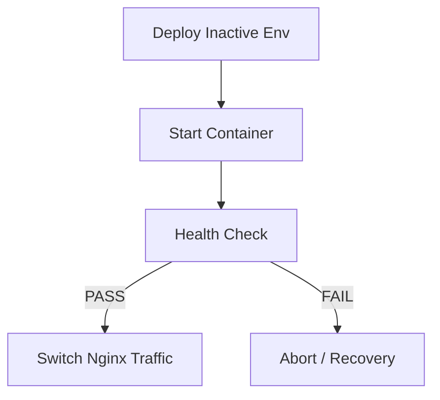
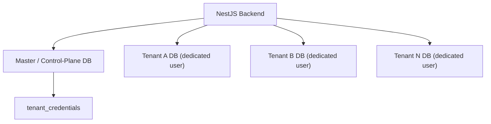
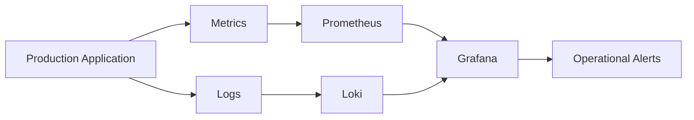

# Innova360 — Production Engineering & DevOps Case Study


> A technical case study documenting the production engineering, DevOps, deployment, database, observability, and automation work I did as a Software Engineer at **Innova360**.

## TL;DR (60-Second Summary)

- **What this is:** A written case study (not a code dump) of the deployment and operations workflow behind a real multi-tenant SaaS backend in production.
- **My role:** Software Engineer whose responsibilities extended into infrastructure, deployment automation, database operations, and observability alongside application development.
- **What I built/implemented directly:** a blue-green deployment workflow (health checks, Nginx traffic switching, rollback), Bash automation for deployment/database/tenant operations, and Prisma migration + backup workflows for a database-per-tenant PostgreSQL setup.
- **What I worked within/contributed to:** the surrounding AWS infrastructure (EC2, ECR, RDS, IAM), the GitHub Actions CI/CD pipeline, and the Prometheus/Grafana/Loki observability stack.
- **Core stack:** AWS (EC2, ECR, RDS, IAM), Docker, GitHub Actions, Nginx, PostgreSQL + Prisma, Prometheus, Grafana, Loki, Bash.
- **Why it matters for DevOps/SRE/Platform roles:** it demonstrates real exposure to deployment safety (health-gated blue-green releases + rollback), data-safety discipline (pre-migration backups, tenant-isolated databases), and operational troubleshooting using metrics + logs — not just tool familiarity.

**Jump to:** [Architecture](#4-production-architecture) · [CI/CD Pipeline](#5-cicd-pipeline) · [Blue-Green & Rollback](#6-blue-green-deployment--rollback) · [Database](#7-database--migration-operations) · [Observability](#8-observability--monitoring) · [Security & Reliability](#10-security--reliability-practices) · [What I'd Improve](#15-what-i-would-improve-today)

---

## Table of Contents

1. [Professional Context](#1-professional-context)
2. [My Role & Responsibilities](#2-my-role--responsibilities)
3. [Technology & Infrastructure Exposure](#3-technology--infrastructure-exposure)
4. [Production Architecture](#4-production-architecture)
5. [CI/CD Pipeline](#5-cicd-pipeline)
6. [Blue-Green Deployment & Rollback](#6-blue-green-deployment--rollback)
7. [Database & Migration Operations](#7-database--migration-operations)
8. [Observability & Monitoring](#8-observability--monitoring)
9. [Automation & Operational Tooling](#9-automation--operational-tooling)
10. [Security & Reliability Practices](#10-security--reliability-practices)
11. [Production Troubleshooting](#11-production-troubleshooting)
12. [Maintenance & Day-to-Day Operations](#12-maintenance--day-to-day-operations)
13. [Engineering Achievements & Impact](#13-engineering-achievements--impact)
14. [What I Learned](#14-what-i-learned)
15. [What I Would Improve Today](#15-what-i-would-improve-today)
16. [Conclusion](#16-conclusion)

---

## 1. Professional Context

During my time at **Innova360**, I worked as a Software Engineer on production applications and became involved in the engineering and operational workflows required to build, deploy, monitor, maintain, and troubleshoot those systems.

My responsibilities extended beyond application development into:

- AWS-based infrastructure and cloud services
- Docker containerization and production deployments
- CI/CD automation with GitHub Actions
- Amazon ECR and EC2-based application delivery
- Blue-green deployment workflows
- Nginx reverse proxy and traffic management
- PostgreSQL database operations and Prisma migrations
- Database backup and recovery procedures
- Production monitoring and observability (Prometheus, Grafana, Loki)
- Bash-based operational automation
- Production troubleshooting, incident resolution, and deployment rollback

This gave me practical exposure to the full lifecycle of a production application — from source code and container builds to deployment, traffic management, database operations, monitoring, troubleshooting, and recovery.

---

## 2. My Role & Responsibilities

My primary responsibility was application development, but I also worked directly with the infrastructure and operational processes surrounding the application.

<details>
<summary><strong>Application & Backend Engineering</strong></summary>

- Developed and maintained backend services and APIs.
- Worked with TypeScript, Node.js, NestJS, PostgreSQL, and Prisma.
- Implemented application features and production fixes.
- Worked with database schemas, migrations, and tenant-specific database operations.
</details>

<details>
<summary><strong>Cloud & Infrastructure</strong></summary>

- Worked with AWS services including EC2, ECR, RDS, IAM, networking, and related infrastructure.
- Worked with Docker and Docker Compose for application packaging and deployment.
- Worked with Nginx as a reverse proxy and HTTPS termination layer.
</details>

<details>
<summary><strong>CI/CD & Deployment</strong></summary>

- Worked with GitHub Actions to automate build and deployment workflows.
- Built and maintained Docker image build/publishing workflows and Amazon ECR usage.
- Worked with EC2-based deployment automation.
- Implemented and maintained the blue-green deployment workflow, including health checks, traffic switching, deployment-state tracking, and rollback procedures. See [Section 6](#6-blue-green-deployment--rollback) for the full mechanics.
</details>

<details>
<summary><strong>Database Operations</strong></summary>

- Worked with PostgreSQL and Prisma migrations in production environments.
- Implemented database backup and migration workflows.
- Investigated migration failures and handled migration conflicts.
- Worked with tenant-specific database migration procedures.
</details>

<details>
<summary><strong>Observability & Operations</strong></summary>

- Worked with Prometheus, Grafana, and Loki for production monitoring and observability.
- Built dashboards and operational monitoring workflows.
- Worked with application logging and alerting.
- Investigated production issues using logs, metrics, container state, deployment state, and infrastructure behavior.
</details>

<details>
<summary><strong>Automation & Troubleshooting</strong></summary>

- Developed Bash scripts for deployment, database operations, image management, and recovery workflows.
- Investigated deployment and runtime failures; performed root-cause analysis and implemented corrective actions.
- Improved operational workflows to reduce repetitive manual tasks.
</details>

---

## 3. Technology & Infrastructure Exposure

| Category | Technologies / Services |
|---|---|
| **Cloud & Infrastructure** | AWS EC2, Amazon ECR, Amazon RDS, IAM, VPC, Security Groups |
| **Containers** | Docker, Docker Compose |
| **CI/CD** | GitHub Actions |
| **Reverse Proxy & Web** | Nginx, HTTPS, Certbot |
| **Backend** | Node.js, NestJS, TypeScript |
| **Database** | PostgreSQL, Prisma ORM |
| **Observability** | Prometheus, Grafana, Loki |
| **Automation** | Bash, Shell scripting |
| **Deployment** | Blue-Green Deployments, Health Checks, Rollback Procedures |
| **Version Control** | Git, GitHub |
| **Application Operations** | Logging, Monitoring, Database Backups, Migrations, Incident Troubleshooting |

```
Application Development → Containerization → CI/CD Automation → Cloud Deployment
        → Traffic Management → Database Operations → Monitoring & Observability
        → Troubleshooting & Recovery
```

---

## 4. Production Architecture

The production environment was built around containerized backend services running on AWS infrastructure, with Nginx handling external HTTPS traffic and PostgreSQL providing persistent application data, plus a dedicated observability stack for metrics, logs, dashboards, and alerting.



> **Note:** The diagram is intentionally simplified to focus on the production components and their relationships rather than every underlying AWS networking detail.

**Core components:**

| Component | Role |
|---|---|
| AWS EC2 | Application hosting environment |
| Docker | Application containerization and runtime isolation |
| Blue / Green Containers | Two deployment environments used for controlled releases |
| Nginx | HTTPS termination, reverse proxy, traffic routing |
| AWS RDS PostgreSQL | Persistent application and tenant data |
| Amazon ECR | Private container image registry |
| Prometheus | Application and infrastructure metrics |
| Grafana | Metrics/log visualization and dashboards |
| Loki | Centralized application log aggregation |
| Alerting | Operational notifications |

A typical request: `Client → DNS → HTTPS → Nginx → Active Container → API → PostgreSQL (RDS)`. The active environment was determined by the current deployment state — see [Section 6](#6-blue-green-deployment--rollback).

---

## 5. CI/CD Pipeline

The production deployment workflow used **GitHub Actions, Docker, Amazon ECR, and AWS EC2** to automate the path from a source-code change to a running production release, including validation, database operations, traffic switching, and rollback.



**Pipeline stages:**

1. **Source change** — a push/merge to `main` triggers the workflow (manual trigger also supported).
2. **Build & version the image** — GitHub Actions checks out the code, configures AWS credentials via GitHub Secrets, builds the Docker image, and tags it `<timestamp>-<short-git-sha>` (plus `latest`) before pushing to a private ECR repo. This gives direct traceability between a running image and the commit that produced it.
3. **Connect to production EC2** — authenticates to ECR, pulls the image, and determines the currently active (blue/green) environment.
4. **Deploy to the inactive environment** — the new container starts alongside the running one; production traffic is untouched at this point.
5. **Health validation** — the new container is checked against `/api/v1/health` with retries; a failed check blocks the release from proceeding. Full gating logic in [Section 6](#health-check-gate).
6. **Database backup & migration** — backup → migration → validation, executed before traffic ever moves. Full detail in [Section 7](#7-database--migration-operations).
7. **Traffic switching** — Nginx config is validated (`nginx -t`) and reloaded to route traffic to the new environment. Full mechanics in [Section 6](#release-flow).
8. **Cleanup** — the previous environment is stopped and deployment state (current image, previous image, timestamp, active color, associated backup) is updated for future deploys/rollbacks.

**Deployment scripts:**

```
deploy-to-ecr.sh          → Build & publish application image
transfer-to-ec2.sh        → Transfer deployment tooling
deploy.sh                 → Production deployment orchestration
db-backup-and-migrate.sh  → Database backup & migration
deployment-state.sh       → Track deployment state
rollback.sh               → Recover previous application/database state
```

Keeping the deployment logic in standalone scripts (rather than inline in CI config) let the CI workflow stay focused on orchestration while the EC2-specific operational logic lived with the deployment target.

---

## 6. Blue-Green Deployment & Rollback

The application used a **blue-green deployment strategy** so new versions could be released without immediately replacing the environment currently serving users. Two environments ran on the same EC2 host — `Blue :4001` and `Green :4002` — with deployment state tracking which one was currently active.



**Why this approach:** the currently running environment stayed available while the new release was prepared and health-checked independently of the traffic switch; deployment state made it possible to identify current vs. previous release; a failed release could trigger recovery instead of overwriting the working version.

### Health-Check Gate

A container starting successfully was **not** treated as "ready." The new environment had to pass `/api/v1/health` (with retries/timeout handling) before deployment could continue:



### Release Flow

Assuming Blue is currently live: the new release deploys to Green, is health-checked, and only then does Nginx's upstream config get updated and reloaded to point at Green — Blue becomes the previous release, kept available for rollback.

### Rollback Strategy

Recovery targeted known failure points: container startup failure, health-check failure, migration failure, or deployment validation failure.

```
New Release → Failure Detected → Stop/Reject New Environment
   → Restore Previous Application State → Restore DB State if Required
   → Switch Nginx Back → Previous Release Serving Traffic
```

Rollback automation used the recorded deployment state and the pre-migration database backup to recover the previous application/database state.

> **Important:** Blue-green here minimizes *application* downtime during release. Database recovery is a separate mechanism (backups + migration/recovery scripts) — it should not be read as a zero-downtime database rollback.

---

## 7. Database & Migration Operations

The backend used **PostgreSQL** with a **database-per-tenant** multi-tenancy model: instead of a shared `tenant_id` column, each tenant got its own PostgreSQL database and dedicated database role. A separate master/control-plane database held the tenant registry and connection metadata.



This gives database-level tenant isolation rather than relying solely on application-level filtering.

<details>
<summary><strong>Tenant provisioning & connection management</strong></summary>

Provisioning: `New Tenant → Create DB → Create Dedicated Role → Grant Permissions → Register Credentials → Initialize Prisma Schema → Seed Records → Tenant Ready`. If provisioning failed partway, the process attempted to clean up partially created resources rather than leaving the system inconsistent.

Connections: pools were created lazily per tenant on first access and reused, each under a defined connection-limit/quota to avoid exhausting PostgreSQL's available connections as concurrency grew. Temporary clients/pools were explicitly released during cleanup paths to reduce leak risk.
> **Configuration Note:** the exact production pool limit can be documented here once confirmed.
</details>

### Prisma Migrations & Safety

Production migrations followed a stricter path than development ones:

```
Validate DB Connectivity → Create Backup → Run Prisma Migration → Validate Result → Continue Deployment
```

Migrations were reviewed for potentially destructive operations before hitting production — dropped columns, foreign-key changes, enum modifications, data-preserving renames, existing data impact, and migration-history conflicts — with safer data-preserving alternatives used where possible.

**Backups:** validated config → tested connectivity → `pg_dump` backup (via a temporary Docker environment, so the host didn't need `pg_dump` installed permanently) → verified non-empty → retained per policy.

<details>
<summary><strong>Tenant-wide schema updates, diagnostics, and cleanup</strong></summary>

Because each tenant has an isolated database, a schema change had to be applied per-tenant rather than once to a shared database:

```
Master DB → Tenant Registry → [Tenant A | Tenant B | Tenant C] → Migration (tracked per tenant)
```

Success/failure was tracked per tenant so one tenant's issue didn't obscure visibility into the others.

**Migration troubleshooting:** `Migration Failure → Inspect Status → Identify Failed Migration → Determine Root Cause → Resolve State → Re-run → Verify`, with safer interactive tooling for development and targeted automated procedures for known production failure modes.

**Diagnostics:** tenant DB existence, credential-registry consistency, DB size, active connections, expected tables, reachability, and permission checks (including controlled operations to confirm a tenant role's actual privileges).

**Teardown:** `Close Connection Pool → Terminate Sessions → Drop Tenant DB → Drop Role → Remove Registry Entry`, with separate FK-relationship inspection to determine a safe deletion order first.
</details>

Overall, the database model combined tenant isolation, connection pooling, migration controls, pre-migration backups, diagnostics, and recovery procedures — treating PostgreSQL operations as a deliberate part of the deployment/reliability process rather than an incidental dependency.

---

## 8. Observability & Monitoring

The stack: **Prometheus** (metrics) → **Grafana** (dashboards) → **Loki** (log aggregation) → **Alerting** (notifications), giving two complementary views: *metrics* answer "what's happening," *logs* answer "why."



- **Prometheus** collected and retained application/infrastructure metrics, queried and visualized through Grafana — useful for spotting trends and abnormal behavior before/during an incident.
- **Grafana** was the shared visualization layer, letting an investigation move from a high-level signal straight to underlying logs without switching systems.
- **Loki** aggregated application logs centrally (rather than relying on per-container logs) — useful for errors, failed requests, deployment issues, runtime exceptions, DB-related failures, and container behavior. Retention was **~7 days**, using filesystem-based TSDB/WAL storage with compaction, balancing troubleshooting needs against storage cost.
- **Alerting** surfaced conditions like HTTP 4xx/5xx error patterns, with notifications integrable into channels like Slack — the goal being actionable signal, not just data collection.

**Troubleshooting workflow:** `Alert/Report → Grafana → Metrics → Identify Time/Service → Query Loki → Trace Error → Root Cause → Fix → Verify` — i.e., symptom → evidence → root cause → verification.

| Signal | Question Answered |
|---|---|
| Metrics | Is the system behaving normally? |
| Logs | What happened inside the application? |
| Alerts | Which conditions need attention? |

---

## 9. Automation & Operational Tooling

A significant part of the workflow was automated through Bash tooling designed to reduce repetitive manual work, standardize procedures, validate prerequisites, and provide predictable recovery paths.

| Area | Purpose |
|---|---|
| Image Publishing | Build, tag, validate, push Docker images to ECR |
| Deployment | Orchestrate releases and environment switching |
| Database Operations | Automate backups, migrations, recovery |
| Infrastructure Setup | Bootstrap EC2 and runtime dependencies |
| Tenant Operations | Provision, migrate, inspect, maintain tenant databases |
| Diagnostics | Verify connectivity, schema state, permissions, deployment state |
| Recovery | Restore previous application/database state when required |

Deployment orchestration centralized the release workflow (prerequisite validation → determine active environment → prepare inactive environment → validate health → allow traffic switch), reducing the risk of partially completed deployments. Database operations were similarly treated as controlled workflows (connectivity validation, backups, backup verification, migration execution/status checks, tenant-wide updates, recovery, retention management) rather than ad-hoc commands, with destructive operations routed through dedicated troubleshooting/recovery scripts.

**Validation & error handling** included: required env-var checks, AWS credential checks, Docker/Compose availability checks, DB connectivity tests, backup validation, health-check retries, meaningful exit codes for pipeline failure, cleanup after failed operations, and deployment-state tracking — the goal being automation that **fails explicitly and safely** rather than leaving production in an unknown state.

**Design principle:** `Validate → Execute → Verify → Recover`.

---

## 10. Security & Reliability Practices

- **Secrets & config:** production secrets lived outside the repo — DB credentials, AWS credentials, and app secrets were supplied via environment configuration and GitHub Actions repository secrets, never committed to Git.
- **Container & resource controls:** Docker Compose configs included memory limits/reservations, container health checks, and log rotation, preventing a single container from consuming unbounded host resources or disk space.
- **Network/HTTPS:** Nginx handled TLS termination (`Internet → HTTPS → Nginx → Container → PostgreSQL`), with HTTP→HTTPS redirection and `nginx -t` config validation before every reload.
- **Database isolation:** each tenant's dedicated PostgreSQL role (rather than a shared credential) reduced the blast radius of tenant-level DB access.
- **Backup & recovery:** backups were created with PostgreSQL tooling, stored in compressed/custom format, validated post-creation, and retained per policy; recovery tooling could restore a previous DB state when a deployment/migration required it.
- **Deployment reliability & failure recovery:** the health-gated blue-green flow (detailed in [Section 6](#6-blue-green-deployment--rollback)) meant traffic only moved after validation passed; deployment state tracking let failed releases be identified and the previous version restored, with database state recovered alongside when necessary.

| Principle | Implementation |
|---|---|
| Protect secrets | Externalized production configuration |
| Validate before applying | Health checks + config validation |
| Limit blast radius | Blue-green deployments + tenant DB isolation |
| Protect data | Backups before critical DB operations |
| Control resources | Container limits + log rotation |
| Detect failures | Monitoring, health checks, alerts |
| Recover quickly | Previous-release and DB recovery procedures |

The overall approach: make production changes **validated, observable, reversible, and recoverable** wherever practical.

---

## 11. Production Troubleshooting

General approach: `Observe → Collect Evidence → Isolate the Failing Layer → Identify Root Cause → Apply Corrective Action → Verify Recovery → Improve the Process`.

Typical investigation sources: application/container logs, Docker/Compose status, PostgreSQL connectivity and migration state, deployment state, Nginx config/traffic state, health-check results, Prometheus metrics, Loki logs, and AWS/EC2/ECR state.

The goal was never just "restore service" — it was understanding **why** a failure occurred and, where practical, improving the workflow so the same failure class becomes easier to detect or recover from next time.

> **Note:** Concrete production incidents and their root causes will be documented here based only on verified incidents from the project history.

---

## 12. Maintenance & Day-to-Day Operations

Production engineering wasn't limited to deployments — ongoing work included:

- **Application:** deploying new versions, verifying container health, monitoring behavior, reviewing logs, investigating errors, managing config changes, validating releases post-deploy.
- **Database:** connectivity checks, Prisma migration management, tenant schema updates, backups, migration troubleshooting, tenant diagnostics, recovery when required (see [Section 7](#7-database--migration-operations)).
- **Deployment:** regular releases followed the pipeline in [Section 5](#5-cicd-pipeline); deployment-state tracking made it possible to identify active vs. previous release when investigating problems.
- **Infrastructure:** EC2 runtime, Docker/Compose, Nginx, SSL/TLS config, ECR images, host resources, and log management — resource limits and log rotation kept the host predictable.
- **Monitoring & incident response:** `Alert/Report → Grafana → Metrics → Loki Logs → Investigation → Fix → Verify Recovery` (see [Section 8](#8-observability--monitoring)).
- **Tenant operations:** provisioning, schema initialization/migrations, connectivity/permission checks, diagnostics, and cleanup — automated to reduce repetitive manual work while keeping success/failure visibility.

**Mindset:** keep production changes **Controlled → Observable → Validated → Recoverable**.

---

## 13. Engineering Achievements & Impact

- **Production deployment automation:** contributed to a GitHub Actions + Docker + ECR + EC2 pipeline with automated deployment scripts, reducing dependence on manual deployment steps.
- **Safer application releases:** implemented and maintained the blue-green workflow — health checks, deployment-state tracking, Nginx traffic switching, and rollback — giving controlled release and recovery paths.
- **Database operational reliability:** built/maintained workflows for backups, migration execution, migration troubleshooting, tenant schema updates, diagnostics, and recovery in a multi-tenant, database-per-tenant PostgreSQL/Prisma environment.
- **Multi-tenant database operations:** worked with tenant provisioning and lifecycle across isolated databases with dedicated credentials, producing a repeatable operational model for many tenant databases.
- **Production observability:** contributed to the Prometheus/Grafana/Loki stack, improving the ability to investigate application behavior from operational evidence rather than user reports alone.
- **Operational automation:** built and maintained Bash tooling for deployment, database operations, infrastructure setup, diagnostics, and recovery, emphasizing validation, explicit failure handling, cleanup, and verification.
- **Reliability & recovery:** contributed to recovery mechanisms spanning both application and database state, using deployment-state tracking to identify and restore previous versions when needed.

```
Manual/Repetitive → Automated → Validated → Observable → Recoverable
```

---

## 14. What I Learned

1. **Deployment is an operational process** — a successful build isn't a successful deployment. It needs validation, health checks, deployment state, monitoring, and a recovery path. My perspective shifted from *"deploy the application"* to *"deploy, verify, observe, and recover."*
2. **Database changes need more care than application changes** — code can be replaced quickly; production data can't. This reinforced understanding migration SQL, protecting existing data, backing up before risky operations, handling failures explicitly, considering tenant impact, and having a recovery procedure.
3. **Observability is part of the system, not an afterthought** — a production system needs enough visibility to answer *what's happening, where, and why*. Prometheus, Grafana, and Loki provided that evidence.
4. **Automation should reduce risk, not just save time** — good automation follows `Validate → Execute → Verify → Handle Failure → Leave a Known State`, especially for deployment and database operations.
5. **Failure handling is part of engineering** — the real question isn't whether failure can be eliminated, but whether the system can `Detect → Contain → Recover → Learn`.
6. **Multi-tenancy increases operational complexity** — database-per-tenant gives clear data boundaries but means a change safe for one database must be safely applied across many, reinforcing the need for automation, diagnostics, and clear failure reporting.
7. **Production engineering requires a systems mindset** — application, container, deployment, network, database, monitoring, and recovery are interconnected; a change in one layer can affect several others.

---

## 15. What I Would Improve Today

These are lessons learned in hindsight, not a claim that the original system was poorly designed.

1. **Reduce deployment host dependency** — move toward a managed container platform (Amazon ECS or Kubernetes) to reduce orchestration logic living directly on the server.
2. **Strengthen Infrastructure as Code** — represent infra/config more comprehensively in Terraform: version-controlled, reviewable, reproducible.
3. **Improve secret management** — centralize sensitive configuration in AWS Secrets Manager or Parameter Store rather than environment-based config alone.
4. **Expand automated testing** — extend CI with `Lint → Unit Tests → Integration Tests → Security Checks → Build → Deploy → Health Validation` to catch issues earlier.
5. **Improve database migration automation** — explicit per-tenant migration version tracking, controlled parallel execution, better failure reporting, retry strategies, and automated schema-drift detection.
6. **Strengthen observability** — add structured application metrics and clearer SLIs: request latency, error rates, throughput, DB performance, resource utilization, deployment health.
7. **Reduce manual operational recovery** — move toward `Manual investigation → Automated diagnosis → Controlled recovery`, automating common recovery scenarios while keeping destructive operations behind explicit validation/approval.
8. **Improve environment isolation** — clearer separation between dev/staging/production so deployment workflows can be validated against a production-like staging environment first.

**Overall direction:** More reproducible → More observable → More secure → Easier to recover → Less manually operated. Production maturity comes from improving the *entire operational system*, not from adding tools for their own sake.

---

## 16. Conclusion

This experience gave me practical exposure to the full lifecycle of a production application — development, containerization, deployment, monitoring, database operations, troubleshooting, and recovery — and, more importantly, how these areas interact in a real production environment:

```
Develop → Build → Deploy → Validate → Monitor → Troubleshoot → Recover → Improve
```

Working with AWS, Docker, GitHub Actions, ECR, EC2, PostgreSQL, Prisma, Nginx, Prometheus, Grafana, Loki, and Bash gave me practical experience across both software engineering and production operations, and shaped a systems-oriented approach:

> Build software that can be deployed safely, observed clearly, troubleshot systematically, and recovered reliably.

This experience is the foundation for my continued growth toward **DevOps and Cloud Engineering**, where development, infrastructure, automation, security, and reliability come together.

### Professional Takeaway

**Software Engineering + Production Operations + Cloud Infrastructure + Automation**
