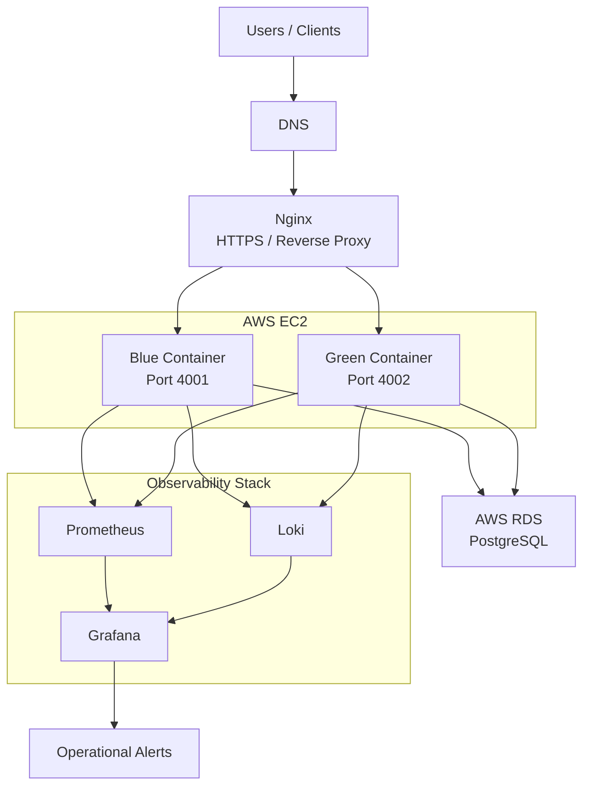
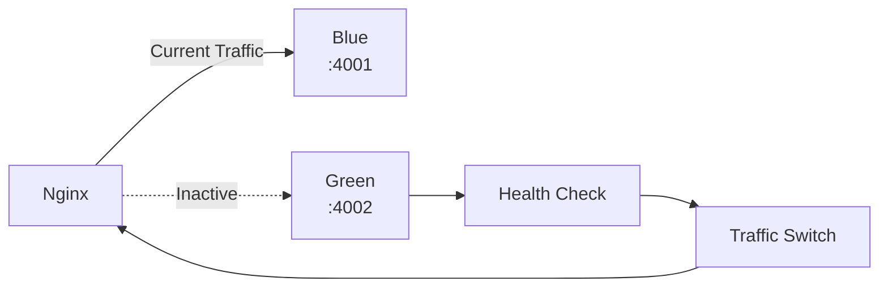
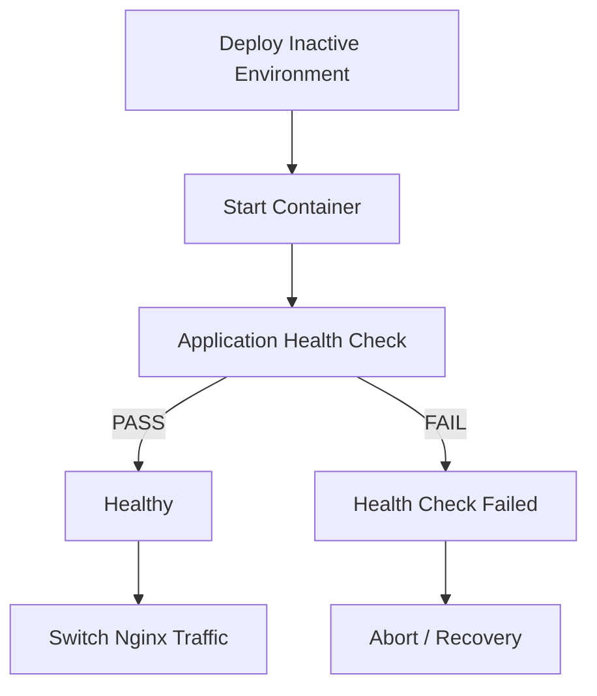
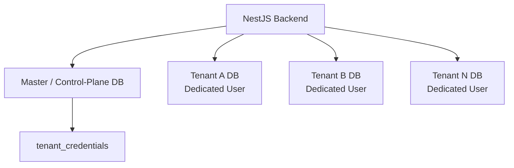
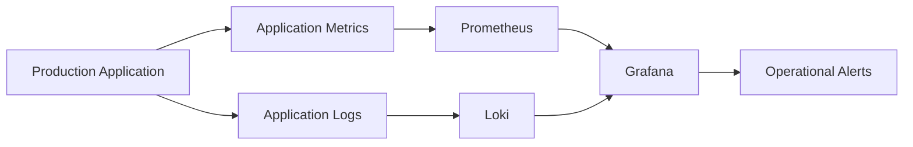

# Innova360 — Production Engineering & DevOps

> A technical case study documenting my production engineering, DevOps, deployment, infrastructure, database, observability, automation, and troubleshooting experience at Innova360.

## 1. Professional Context

During my time at **Innova360**, I worked as a Software Engineer on production applications and became involved in the engineering and operational workflows required to build, deploy, monitor, maintain, and troubleshoot those systems.

My responsibilities extended beyond application development into areas such as:

* AWS-based infrastructure and cloud services
* Docker containerization and production deployments
* CI/CD automation with GitHub Actions
* Amazon ECR and EC2-based application delivery
* Blue-green deployment workflows
* Nginx reverse proxy and traffic management
* PostgreSQL database operations and Prisma migrations
* Database backup and recovery procedures
* Production monitoring and observability
* Prometheus, Grafana, and Loki
* Bash-based operational automation
* Production troubleshooting and incident resolution
* Deployment rollback and recovery procedures

This experience gave me practical exposure to the full lifecycle of a production application — from source code and container builds to deployment, traffic management, database operations, monitoring, troubleshooting, and recovery.

---

## 2. My Role & Responsibilities

As a Software Engineer, my primary responsibility was application development, but I also worked directly with the infrastructure and operational processes surrounding the applications.

### Application & Backend Engineering

* Developed and maintained backend services and APIs.
* Worked with TypeScript, Node.js, NestJS, PostgreSQL, and Prisma.
* Implemented application features and production fixes.
* Worked with database schemas, migrations, and tenant-specific database operations.

### Cloud & Infrastructure

* Worked with AWS services including EC2, ECR, RDS, IAM, networking, and related infrastructure.
* Worked with Docker and Docker Compose for application packaging and deployment.
* Worked with Nginx as a reverse proxy and HTTPS termination layer.

### CI/CD & Deployment

* Worked with GitHub Actions to automate application build and deployment workflows.
* Built and maintained Docker image build and publishing workflows.
* Worked with Amazon ECR for private container image storage.
* Worked with EC2-based deployment automation.
* Implemented and maintained blue-green application deployment workflows.
* Added deployment health checks, traffic switching, deployment state tracking, and rollback procedures.

### Database Operations

* Worked with PostgreSQL and Prisma migrations in production environments.
* Implemented database backup and migration workflows.
* Investigated migration failures and handled migration conflicts.
* Worked with tenant-specific database migration procedures.

### Observability & Operations

* Worked with Prometheus, Grafana, and Loki for production monitoring and observability.
* Built dashboards and operational monitoring workflows.
* Worked with application logging and alerting.
* Investigated production issues using application logs, metrics, container state, deployment state, and infrastructure behavior.

### Automation & Troubleshooting

* Developed Bash scripts for deployment, database operations, image management, and recovery workflows.
* Investigated deployment and runtime failures.
* Performed root-cause analysis and implemented corrective actions.
* Improved operational workflows to reduce repetitive manual tasks.

## 3. Technology & Infrastructure Exposure

The following technologies and systems were part of my practical engineering and production operations exposure at Innova360.

| Category                   | Technologies / Services                                                     |
| -------------------------- | --------------------------------------------------------------------------- |
| **Cloud & Infrastructure** | AWS EC2, Amazon ECR, Amazon RDS, IAM, VPC, Security Groups                  |
| **Containers**             | Docker, Docker Compose                                                      |
| **CI/CD**                  | GitHub Actions                                                              |
| **Reverse Proxy & Web**    | Nginx, HTTPS, Certbot                                                       |
| **Backend**                | Node.js, NestJS, TypeScript                                                 |
| **Database**               | PostgreSQL, Prisma ORM                                                      |
| **Observability**          | Prometheus, Grafana, Loki                                                   |
| **Automation**             | Bash, Shell scripting                                                       |
| **Deployment**             | Blue-Green Deployments, Health Checks, Rollback Procedures                  |
| **Version Control**        | Git, GitHub                                                                 |
| **Application Operations** | Logging, Monitoring, Database Backups, Migrations, Incident Troubleshooting |

### Production Engineering Areas

My practical exposure covered the following areas across the application lifecycle:

```text
Application Development
        ↓
Containerization
        ↓
CI/CD Automation
        ↓
Cloud Deployment
        ↓
Traffic Management
        ↓
Database Operations
        ↓
Monitoring & Observability
        ↓
Troubleshooting & Recovery
```

The following sections document how these systems were actually used in the production environment.

## 4. Production Architecture

The production environment was built around containerized backend services running on AWS infrastructure, with Nginx handling external HTTPS traffic and PostgreSQL providing persistent application data.

The architecture also included dedicated observability components for metrics, logs, dashboards, and operational alerting.

### Architecture Overview



> **Note:** The diagram is intentionally simplified to focus on the production components and their relationships rather than every underlying AWS networking detail.

### Core Components

| Component                   | Role in the Production Environment                              |
| --------------------------- | --------------------------------------------------------------- |
| **AWS EC2**                 | Application hosting environment                                 |
| **Docker**                  | Application containerization and runtime isolation              |
| **Blue / Green Containers** | Two deployment environments used for controlled releases        |
| **Nginx**                   | HTTPS termination, reverse proxy, and traffic routing           |
| **AWS RDS PostgreSQL**      | Persistent application and tenant data                          |
| **Amazon ECR**              | Private container image registry                                |
| **Prometheus**              | Application and infrastructure metrics                          |
| **Grafana**                 | Metrics/log visualization and operational dashboards            |
| **Loki**                    | Centralized application log aggregation                         |
| **Alerting**                | Operational notifications for application/infrastructure issues |

### Production Request Flow

A typical application request followed this path:

```text
Client
  ↓
DNS
  ↓
HTTPS
  ↓
Nginx
  ↓
Active Application Container
  ↓
Application / API
  ↓
PostgreSQL (RDS)
```

The active application environment was determined by the deployment state. During a blue-green deployment, the new version was first deployed to the inactive environment and validated before Nginx traffic was switched to it.

### Operational Flow

The production environment was operated as a continuous lifecycle:

```text
Code
  ↓
Build & Package
  ↓
Deploy
  ↓
Validate
  ↓
Serve Traffic
  ↓
Monitor
  ↓
Troubleshoot
  ↓
Recover / Roll Back
```

The following sections break down these operational workflows individually.

## 5. CI/CD Pipeline

The production deployment workflow used **GitHub Actions, Docker, Amazon ECR, and AWS EC2** to automate the path from source-code changes to a running production release.

The workflow also incorporated deployment validation, database operations, traffic switching, and rollback procedures.

### Complete Deployment Flow

```mermaid
flowchart LR
    Developer["Developer"]
    Git["Git Push<br/>main"]
    Actions["GitHub Actions"]

    Build["Build Docker Image"]
    Version["Generate Version<br/>Timestamp + Git SHA"]
    ECR["Amazon ECR"]

    SSH["SSH to EC2"]
    Deploy["deploy.sh"]

    Detect["Detect Active Color"]
    Inactive["Deploy to Inactive<br/>Environment"]
    Health["Health Check"]

    Backup["Database Backup"]
    Migration["Run Database Migration"]

    Switch["Switch Nginx Traffic"]
    Cleanup["Stop Previous Environment"]

    Developer --> Git
    Git --> Actions
    Actions --> Build
    Build --> Version
    Version --> ECR
    ECR --> SSH
    SSH --> Deploy
    Deploy --> Detect
    Detect --> Inactive
    Inactive --> Health
    Health --> Backup
    Backup --> Migration
    Migration --> Switch
    Switch --> Cleanup
```



### Pipeline Stages

#### 1. Source Change

A change merged or pushed to the `main` branch triggered the deployment workflow.

```text
Git Push → GitHub Actions
```

The workflow could also be triggered manually when required.

---

#### 2. Build & Version Docker Image

GitHub Actions:

* Checked out the application source code.
* Configured AWS credentials through GitHub Secrets.
* Built the Docker image.
* Generated a unique image version using a timestamp and short Git commit SHA.
* Tagged the image with both the version and `latest`.
* Pushed the image to the private Amazon ECR repository.

Example version pattern:

```text
<timestamp>-<short-git-sha>
```

This provided traceability between a production image and the source commit that produced it.

---

#### 3. Connect to Production EC2

After the image was available in ECR, the workflow connected to the production EC2 environment and executed the deployment automation.

The deployment process handled:

* AWS ECR authentication
* Pulling the required image
* Determining the currently active environment
* Selecting the inactive environment for the new release

---

#### 4. Deploy to the Inactive Environment

The deployment did not immediately replace the running application.

Instead:

```text
Active
  ↓
Blue :4001

New Release
  ↓
Green :4002
```

or the reverse, depending on the current deployment state.

The new container was started independently while the existing production environment continued serving traffic.

---

#### 5. Health Validation

Before switching production traffic, the newly deployed container was tested through its application health endpoint:

```text
/api/v1/health
```

The deployment automation retried the health check and waited for the application to become healthy.

A failed health check prevented the deployment from progressing to the traffic-switching stage.

---

#### 6. Database Backup & Migration

Once the new application environment was validated, the deployment workflow performed the required database operations.

The process included:

```text
Database Backup
      ↓
Migration Execution
      ↓
Migration Validation
```

Database backups were retained according to the production backup policy, allowing recovery procedures to be executed if a deployment introduced a database-related failure.

---

#### 7. Traffic Switching

After the new environment and database operations were successfully completed, Nginx was updated to route traffic to the new application environment.

The configuration was validated before reloading Nginx:

```text
nginx -t
    ↓
Nginx Reload
    ↓
Traffic → New Environment
```

This allowed traffic to move between the blue and green environments without rebuilding or replacing the entire production host.

---

#### 8. Cleanup

After successful traffic switching, the previous application environment was stopped according to the deployment procedure.

The deployment state was also updated so the system could identify:

* Current image
* Previous image
* Deployment timestamp
* Active color
* Associated database backup

This information supported subsequent deployments and rollback operations.

### Deployment Automation

The deployment workflow was divided into reusable operational scripts rather than placing the entire process inside the CI configuration.

Key scripts included:

```text
deploy-to-ecr.sh
    ↓
Build & publish application image

transfer-to-ec2.sh
    ↓
Transfer deployment tooling

deploy.sh
    ↓
Production deployment orchestration

db-backup-and-migrate.sh
    ↓
Database backup & migration

deployment-state.sh
    ↓
Track deployment state

rollback.sh
    ↓
Recover previous application/database state
```

This separation kept the CI workflow responsible for orchestration while production-specific deployment logic remained on the deployment environment.

### Deployment Result

The overall workflow transformed a source-code change into a controlled production release:

```text
Git Commit
    ↓
Automated Build
    ↓
Versioned Docker Image
    ↓
Private ECR
    ↓
Inactive Environment
    ↓
Health Validation
    ↓
Database Operations
    ↓
Nginx Traffic Switch
    ↓
Production Release
```

The next section focuses specifically on the **blue-green deployment strategy**, including traffic switching, deployment state, health checks, and rollback behavior.

## 6. Blue-Green Deployment & Rollback

The production application used a **blue-green deployment strategy** to release new application versions without immediately replacing the environment currently serving users.

Two application environments were maintained on the same EC2 host:

```text
Blue  → Port 4001
Green → Port 4002
```

At any point, one environment served production traffic while the other was available for deploying and validating the next release.

### Deployment Model



The active environment was determined from the deployment state, allowing the deployment automation to consistently identify the inactive environment for the next release.

### Release Flow

Assuming Blue is currently serving production traffic:

```text id="g0p4as"
Blue :4001
   │
   │ Production Traffic
   ▼
 Users

Green :4002
   │
   │ New Release
   ▼
 Deploy → Start → Health Check
```

Once the new Green environment passed validation:

```text id="2g4l6k"
Before

Users
  ↓
Nginx
  ↓
Blue :4001

Green :4002
(New Release)
```

```text id="q7y5sa"
After

Users
  ↓
Nginx
  ↓
Green :4002

Blue :4001
(Previous Release)
```

The traffic switch was performed by updating the Nginx upstream configuration and validating it before reloading Nginx.

### Why This Approach Was Used

The deployment strategy provided several operational advantages:

* The currently running environment remained available while the new release was prepared.
* The new application version could be health-checked before receiving production traffic.
* Traffic switching was performed independently from application startup.
* The previous environment could remain available during the transition.
* Deployment state made it possible to identify the current and previous release.
* A failed release could trigger recovery procedures instead of immediately replacing the working version.

### Deployment State

The deployment process maintained state information describing the current production release.

The state included information such as:

```text id="u1w8do"
Current Image
Previous Image
Deployment Timestamp
Database Backup
Active Color
```

This allowed subsequent deployments and rollback operations to understand the current production state instead of relying solely on manually maintained information.

### Health-Check Gate

A new environment was not considered ready simply because its Docker container started successfully.

The deployment process validated the application through:

```text id="j7d8y0"
/api/v1/health
```

The health-check process included retries and timeout handling before the deployment was allowed to continue.

Conceptually:



This made application health a deployment decision rather than assuming that a successfully started container meant a successful deployment.

### Rollback Strategy

Rollback procedures were designed around restoring the previously known-good application state when a deployment failed.

Potential failure points included:

* Container startup failure
* Application health-check failure
* Database migration failure
* Deployment validation failure

The recovery concept was:

```text id="q2l4xz"
New Release
    ↓
Failure Detected
    ↓
Stop / Reject New Environment
    ↓
Restore Previous Application State
    ↓
Restore Database State if Required
    ↓
Switch Nginx Back
    ↓
Previous Release Serving Traffic
```

The rollback automation could use the recorded deployment state and database backup to recover the previous application/database state.

### Deployment Safety Model

The overall strategy can be summarized as:

```text id="d3g9wy"
Deploy New Version
       ↓
Validate
       ↓
   ┌───┴───┐
   ↓       ↓
 PASS     FAIL
   ↓       ↓
Switch   Recover
Traffic  Previous State
   ↓       ↓
Success  Previous Release
```

This approach separated **deployment**, **validation**, **traffic switching**, and **recovery** into distinct operational stages.

> **Important:** The application deployment used blue-green techniques to minimize production interruption. Database recovery was handled separately through backups and migration/recovery procedures; it should not be described as a zero-downtime database rollback.

## 7. Database & Migration Operations

The backend used **PostgreSQL** with a database-per-tenant multi-tenancy architecture. Instead of isolating tenants through a shared `tenant_id` column, each tenant was provisioned with its own PostgreSQL database and dedicated database user.

A separate master/control-plane database maintained the tenant registry and connection information required to manage these isolated databases.

### Database Architecture



This architecture provided database-level tenant isolation rather than relying solely on application-level filtering.

### Tenant Provisioning

Tenant onboarding involved several steps:

```text
New Tenant
    ↓
Create PostgreSQL Database
    ↓
Create Dedicated Database Role
    ↓
Grant Database Permissions
    ↓
Register Tenant Credentials
    ↓
Initialize Prisma Schema
    ↓
Seed Initial Records
    ↓
Tenant Ready
```

The provisioning logic also included cleanup behavior. If tenant creation failed partway through, the process attempted to remove partially created resources so the system would not remain in an inconsistent state.

### Tenant Connection Management

The application maintained separate connection pools for tenant databases.

Rather than creating a new database connection for every request, pools were created lazily when a tenant was first accessed and then reused.

```text
Tenant Request
      ↓
Tenant ID
      ↓
Tenant Connection Pool
      ↓
Available Connection
      ↓
Tenant PostgreSQL DB
```

Each pool operated with a **defined connection limit/quota**, controlling how many PostgreSQL connections could be opened concurrently.

This helped prevent uncontrolled connection creation and reduced the risk of exhausting the database's available connection capacity as application concurrency increased.

> **Configuration Note:** The exact production pool limit can be documented here once confirmed.

Temporary database clients and pools were also explicitly released or closed during cleanup paths to reduce the risk of connection leaks.

### Prisma Migration Management

Database schema changes were managed through **Prisma migrations**.

Development and production migration workflows were treated differently because production schema changes required additional safety measures.

The production workflow followed the general sequence:

```text
Validate Database Connectivity
        ↓
Create Database Backup
        ↓
Run Prisma Migration
        ↓
Validate Result
        ↓
Continue Deployment
```

Before migrations, the deployment process verified the database connection and created a backup that could be referenced by the recovery workflow.

### Migration Safety

Migration changes were reviewed for potentially destructive operations before being applied to production.

Particular attention was given to changes involving:

* Dropping columns
* Foreign-key relationships
* Enum modifications
* Data-preserving renames
* Existing production data
* Migration history conflicts

Where appropriate, destructive schema changes were replaced with safer data-preserving operations.

### Production Database Backups

Production migrations were preceded by a database backup.

The backup workflow:

1. Validated required database configuration.
2. Tested database connectivity.
3. Created a PostgreSQL backup using `pg_dump`.
4. Stored the backup for potential recovery.
5. Verified that the backup was not empty.
6. Maintained a defined backup retention window.

The backup process used a temporary Docker environment for `pg_dump`, avoiding a dependency on the database tooling being permanently installed on the production host.

### Tenant-Wide Schema Updates

Because each tenant had an isolated database, a schema change could not simply be applied once to a shared database.

A dedicated migration workflow iterated through the tenant databases and applied pending Prisma migrations individually.

```text
Master DB
    ↓
Tenant Registry
    ↓
┌───────────┬───────────┬───────────┐
↓           ↓           ↓
Tenant A    Tenant B    Tenant C
  ↓           ↓           ↓
Migration   Migration   Migration
```

The process tracked success and failure for individual tenants so that an issue affecting one tenant could be identified without losing visibility into the others.

### Migration Troubleshooting

Several operational scripts existed specifically to diagnose and recover from Prisma migration problems.

The troubleshooting workflow could include:

```text
Migration Failure
      ↓
Inspect Migration Status
      ↓
Identify Failed Migration
      ↓
Determine Root Cause
      ↓
Resolve Migration State
      ↓
Re-run Migration
      ↓
Verify Database
```

Different tooling existed for development and production scenarios, including safer interactive recovery for development and targeted automated procedures for known production failure modes.

### Database Diagnostics

The system also included diagnostic tooling for validating tenant health.

Checks included:

* Tenant database existence
* Tenant credential registry consistency
* Database size
* Active connection count
* Expected table existence
* Database reachability
* Tenant database permissions

Permission verification could perform controlled database operations to confirm that the tenant-specific PostgreSQL role had the required privileges.

### Tenant Deletion & Cleanup

Tenant teardown was designed to clean up both application-level and database-level resources.

The database-side lifecycle included:

```text
Tenant Deletion
      ↓
Close Tenant Connection Pool
      ↓
Terminate Remaining Sessions
      ↓
Drop Tenant Database
      ↓
Drop Tenant Role
      ↓
Remove Tenant Registry Entry
```

Separate diagnostic tooling was used to inspect foreign-key relationships and determine a safe deletion sequence before performing destructive operations.

### Database Reliability Model

The overall database operational model combined:

```text
Tenant Isolation
      +
Connection Pooling
      +
Migration Controls
      +
Pre-Migration Backups
      +
Diagnostics
      +
Recovery Procedures
```

This made database management a deliberate part of the production deployment and reliability process rather than treating PostgreSQL as simply an application dependency.

## 8. Observability & Monitoring

The production environment used a dedicated observability stack to monitor application behavior, collect logs, visualize operational data, and surface production issues.

The stack consisted of:

* **Prometheus** — metrics collection
* **Grafana** — dashboards and visualization
* **Loki** — centralized log aggregation
* **Alerting** — operational notifications

### Observability Architecture



The goal was to provide two complementary views of the production system:

```text id="3b7r1u"
Metrics → What is happening?
Logs    → Why is it happening?
```

### Prometheus

Prometheus was used to collect and retain application/infrastructure metrics.

The monitoring setup exposed metrics that could be queried and visualized through Grafana, providing visibility into application behavior and operational health.

Metrics were particularly useful for identifying trends and detecting abnormal behavior before or during an incident.

### Grafana

Grafana served as the primary visualization layer.

Dashboards provided a centralized view of operational information collected from Prometheus and Loki.

This made it possible to move from a high-level indication of a problem to the underlying logs without switching between multiple monitoring systems.

### Loki

Loki was used for centralized application log collection.

Instead of relying exclusively on logs stored inside individual containers, application logs could be aggregated and queried through the observability stack.

This was particularly useful when investigating:

* Application errors
* Failed requests
* Deployment issues
* Runtime exceptions
* Database-related failures
* Container behavior

### Log Retention

Loki was configured with a defined retention period rather than retaining logs indefinitely.

The production setup used approximately **7 days of log retention**, balancing troubleshooting requirements against storage consumption.

The logging stack used filesystem-based storage with a TSDB/WAL-based configuration and compaction to manage retained log data.

### Alerting

Operational alerts were configured to surface important application conditions.

For example, HTTP **4xx/5xx error patterns** could be monitored and surfaced through the alerting workflow.

Notifications could be integrated with operational communication channels such as Slack.

The purpose was not simply to collect data, but to turn production signals into actionable information.

### Troubleshooting Workflow

The observability stack supported a practical investigation workflow:

```text id="6x4m6v"
Alert / User Report
       ↓
Check Grafana
       ↓
Inspect Metrics
       ↓
Identify Time / Service
       ↓
Query Loki Logs
       ↓
Trace Error
       ↓
Investigate Root Cause
       ↓
Apply Fix
       ↓
Verify Metrics / Logs
```

This provided a structured path from **symptom → evidence → root cause → verification**.

### Operational Value

The monitoring setup provided visibility across three important dimensions:

| Signal      | Question Answered                     |
| ----------- | ------------------------------------- |
| **Metrics** | Is the system behaving normally?      |
| **Logs**    | What happened inside the application? |
| **Alerts**  | Which conditions require attention?   |

Together, these tools formed the operational feedback loop used to monitor and troubleshoot the production environment.

## 9. Automation & Operational Tooling

A significant part of the production workflow was automated through Bash-based operational tooling.

The scripts were designed to reduce repetitive manual work, standardize operational procedures, validate prerequisites, and provide predictable recovery paths.

### Operational Automation Areas

| Area                 | Purpose                                                              |
| -------------------- | -------------------------------------------------------------------- |
| Image Publishing     | Build, tag, validate, and push Docker images to ECR                  |
| Deployment           | Orchestrate application releases and environment switching           |
| Database Operations  | Automate backups, migrations, and recovery procedures                |
| Infrastructure Setup | Bootstrap EC2 and required runtime dependencies                      |
| Tenant Operations    | Provision, migrate, inspect, and maintain tenant databases           |
| Diagnostics          | Verify connectivity, schema state, permissions, and deployment state |
| Recovery             | Restore previous application/database state when required            |

### Deployment Orchestration

The main deployment automation centralized the release workflow instead of requiring individual commands to be executed manually.

The deployment process performed prerequisite validation, determined the active environment, prepared the inactive environment, validated application health, and only then allowed production traffic to switch.

This reduced the risk of partially completed deployments.

### Database Safety Automation

Database operations were treated as controlled operational workflows rather than ad-hoc commands.

Automation included:

* Connectivity validation
* PostgreSQL backups
* Backup verification
* Migration execution
* Migration status checks
* Tenant-wide schema updates
* Recovery procedures
* Backup retention management

Where destructive or potentially unsafe operations were involved, dedicated troubleshooting and recovery scripts were used rather than embedding those actions into normal deployment paths.

### Tenant Operations

Because the application used database-per-tenant isolation, several operational tasks had to be performed across individual tenant databases.

Automation was used for tasks such as:

```text
Master Tenant Registry
        ↓
Discover Tenant Databases
        ↓
Run Operation Per Tenant
        ↓
Record Success / Failure
        ↓
Produce Operational Summary
```

This reduced the need to manually repeat database commands for every tenant.

### Validation & Error Handling

Operational scripts included defensive checks before performing important actions.

Examples included:

* Required environment variable validation
* AWS credential checks
* Docker/Compose availability checks
* Database connectivity tests
* Backup validation
* Health-check retries
* Exit codes for pipeline failure
* Cleanup after failed operations
* Deployment-state tracking

The objective was to make automation **fail explicitly and safely**, rather than silently leaving the production environment in an unknown state.

### Operational Design Principles

The automation followed several practical principles:

**Validate → Execute → Verify → Recover**

Rather than treating automation as simply "running commands automatically", each workflow was designed around the expected operational lifecycle.

This made the scripts useful not only for normal deployments, but also for maintenance, troubleshooting, and recovery.

## 10. Security & Reliability Practices

Security and reliability were incorporated into the application deployment and operational workflows.

The focus was on protecting production credentials and data, reducing deployment risk, controlling resource usage, and providing recovery mechanisms when failures occurred.

### Secrets & Configuration

Production secrets were kept outside the source repository.

Sensitive configuration was supplied through environment-based configuration and deployment secrets rather than being committed to Git.

Examples included:

* Database credentials
* AWS credentials
* Application secrets
* Production environment configuration

GitHub Actions used repository secrets for credentials required by the deployment workflow.

### Container Security & Resource Controls

Production containers were operated with defined resource constraints.

Docker Compose configurations included:

* Memory limits
* Memory reservations
* Container health checks
* Log rotation

Resource limits helped prevent a single application container from consuming uncontrolled amounts of host resources.

Log rotation also prevented container logs from growing indefinitely and consuming disk space.

### Network & HTTPS Security

Nginx acted as the production reverse proxy and TLS termination layer.

The deployment configuration included:

```text
Internet
   ↓
HTTPS
   ↓
Nginx
   ↓
Application Container
   ↓
PostgreSQL
```

HTTP-to-HTTPS redirection and TLS certificates provided encrypted communication between clients and the production application.

Nginx configuration was validated with `nginx -t` before reloading the service, preventing an invalid configuration from being applied blindly.

### Database Isolation

The multi-tenant architecture provided database-level separation between tenants.

Each tenant database used a dedicated PostgreSQL role rather than sharing a single database credential across all tenant databases.

This reduced the blast radius of tenant-level database access and provided clearer boundaries for tenant operations.

### Database Protection & Recovery

Production database changes were preceded by controlled backup procedures where appropriate.

Backups were:

* Created using PostgreSQL tooling
* Stored in a compressed/custom format
* Validated after creation
* Retained according to a defined retention policy

Recovery tooling was also available to restore a previous database state when a deployment or migration required rollback.

### Deployment Reliability

The blue-green deployment strategy reduced the risk of exposing an unvalidated release directly to production traffic.

The deployment workflow followed:

```text
Deploy Inactive Environment
        ↓
Health Check
        ↓
PASS ─────────→ Switch Traffic
        │
        ↓
FAIL
        ↓
Stop Failed Release
        ↓
Keep Previous Release Active
```

Traffic was switched only after the new application passed health validation.

### Failure Recovery

Deployment state was tracked so that the system could identify the current and previous application versions.

When a deployment failed, recovery procedures could restore the previous application version and, when necessary, recover the associated database state.

This provided a controlled recovery path instead of relying on manual reconstruction of the previous production state.

### Reliability Principles

The production workflows followed a few core principles:

| Principle                | Implementation                                    |
| ------------------------ | ------------------------------------------------- |
| Protect secrets          | Externalized production configuration             |
| Validate before applying | Health checks and configuration validation        |
| Limit blast radius       | Blue-green deployments and tenant DB isolation    |
| Protect data             | Backups before critical DB operations             |
| Control resources        | Container limits and log rotation                 |
| Detect failures          | Monitoring, health checks and alerts              |
| Recover quickly          | Previous release and database recovery procedures |

The overall approach was to make production changes **validated, observable, reversible, and recoverable** wherever practical.

## 11. Production Troubleshooting

Production troubleshooting involved investigating failures across the application, containers, database, deployment pipeline, and infrastructure.

The general troubleshooting approach was:

```text
Observe
  ↓
Collect Evidence
  ↓
Isolate the Failing Layer
  ↓
Identify Root Cause
  ↓
Apply Corrective Action
  ↓
Verify Recovery
  ↓
Improve the Process
```

Typical investigation sources included:

* Application and container logs
* Docker/Compose status
* PostgreSQL connectivity and migration state
* Deployment state
* Nginx configuration and traffic state
* Health-check results
* Prometheus metrics
* Loki logs
* AWS/EC2/ECR state

### Troubleshooting Philosophy

The objective was not simply to restore service, but to determine **why the failure occurred** and, where practical, improve the deployment or operational workflow so that the same class of problem could be detected or recovered from more reliably.

> **Note:** Concrete production incidents and their root causes will be documented here based only on verified incidents from the project history.

## 12. Maintenance & Day-to-Day Operations

Production engineering was not limited to deployments. Ongoing maintenance involved monitoring application health, managing releases, handling database operations, investigating issues, and keeping the runtime environment operational.

### Application Operations

Day-to-day application operations included:

* Deploying new application versions
* Verifying container health
* Monitoring application behavior
* Reviewing production logs
* Investigating application errors
* Managing configuration changes
* Validating releases after deployment

### Database Operations

Database maintenance included:

* PostgreSQL connectivity checks
* Prisma migration management
* Tenant database schema updates
* Database backups
* Migration troubleshooting
* Tenant database diagnostics
* Recovery procedures when required

Database changes were treated carefully because application availability and data integrity were directly connected to migration operations.

### Deployment Operations

Regular releases followed the established deployment workflow:

```text
Code Change
    ↓
CI/CD Build
    ↓
ECR Image
    ↓
Inactive Environment
    ↓
Health Validation
    ↓
Traffic Switch
    ↓
Post-Deployment Verification
```

Deployment state tracking made it possible to identify the active release and previous release when investigating deployment problems.

### Infrastructure Maintenance

Production infrastructure maintenance included operational work around:

* EC2 runtime environment
* Docker and Docker Compose
* Nginx
* SSL/TLS configuration
* ECR images
* Host resources
* Application logs

Resource limits and log rotation helped keep the EC2 environment predictable during normal operation.

### Monitoring & Incident Response

Monitoring was part of the regular operational workflow rather than something used only after an incident.

A typical investigation involved:

```text
Alert / Report
     ↓
Grafana
     ↓
Metrics
     ↓
Loki Logs
     ↓
Application / Container / DB Investigation
     ↓
Fix
     ↓
Verify Recovery
```

### Tenant Operations

The database-per-tenant architecture required operational tasks across individual tenant databases.

Depending on the task, this included:

* Tenant provisioning
* Schema initialization
* Schema migrations
* Connectivity and permission checks
* Database diagnostics
* Tenant cleanup procedures

Automation reduced repetitive manual work while maintaining visibility into successful and failed operations.

### Production Maintenance Mindset

The operational goal was to keep production changes:

**Controlled → Observable → Validated → Recoverable**

This approach helped balance feature delivery with the reliability requirements of a live production environment.

## 13. Engineering Achievements & Impact

My work at Innova360 involved both application development and production engineering, with a strong focus on making deployment and operational workflows more reliable, repeatable, and easier to maintain.

### Production Deployment Automation

Contributed to a production deployment workflow using GitHub Actions, Docker, Amazon ECR, EC2, and automated deployment scripts.

This reduced dependence on manually executed deployment steps and established a repeatable path from source-code changes to production releases.

### Safer Application Releases

Implemented and maintained a blue-green deployment workflow that allowed new application versions to be deployed and validated independently before receiving production traffic.

Health checks, deployment-state tracking, Nginx traffic switching, and rollback procedures provided controlled release and recovery paths.

### Database Operational Reliability

Worked with PostgreSQL and Prisma in a multi-tenant, database-per-tenant environment.

Developed and maintained operational workflows for:

* Database backups
* Migration execution
* Migration troubleshooting
* Tenant schema updates
* Database diagnostics
* Recovery procedures

This made database changes more controlled and reduced reliance on ad-hoc manual procedures.

### Multi-Tenant Database Operations

Worked with tenant provisioning and lifecycle operations involving isolated PostgreSQL databases and dedicated database credentials.

Operational tooling supported tenant creation, schema initialization, diagnostics, migrations, and cleanup.

This provided a repeatable operational model for managing multiple tenant databases.

### Production Observability

Contributed to an observability stack using Prometheus, Grafana, and Loki.

The system provided centralized metrics, logs, dashboards, and alerting that supported production monitoring and troubleshooting.

This improved the ability to investigate application behavior using operational evidence rather than relying exclusively on user reports.

### Operational Automation

Built and maintained Bash-based tooling for recurring production tasks including deployment, database operations, infrastructure setup, diagnostics, and recovery.

The automation emphasized validation, explicit failure handling, cleanup, and verification.

### Reliability & Recovery

Contributed to recovery mechanisms covering both application and database state.

The production workflow maintained information about the current and previous deployment, allowing failed releases to be identified and previous application versions to be restored when required.

### Engineering Impact

Overall, the work helped move operational workflows toward:

```text
Manual / Repetitive
        ↓
Automated
        ↓
Validated
        ↓
Observable
        ↓
Recoverable
```

The experience provided practical exposure to operating production software across the full lifecycle:

**Develop → Build → Deploy → Monitor → Troubleshoot → Recover → Improve**

## 14. What I Learned

Working with a production system changed the way I approach software engineering.

Building an application and operating an application are different responsibilities. Production introduces constraints around reliability, data integrity, observability, security, recovery, and the consequences of failure.

### 1. Deployment Is an Operational Process

A successful build does not necessarily mean a successful deployment.

A production release needs:

* Validation before traffic is switched
* Health checks
* Deployment state
* Monitoring
* A recovery path

This changed my perspective from **“deploy the application”** to **“deploy, verify, observe, and recover.”**

### 2. Database Changes Require More Care Than Application Changes

Application code can often be replaced quickly. Production data cannot.

Working with PostgreSQL and Prisma reinforced the importance of:

* Understanding migration SQL
* Protecting existing data
* Taking backups before risky operations
* Handling migration failures explicitly
* Considering tenant impact
* Having a recovery procedure

### 3. Observability Is Part of the System

Logs and metrics should not be treated as an afterthought.

A production system needs enough visibility to answer:

> **What is happening, where is it happening, and why?**

Prometheus, Grafana, and Loki provided the operational evidence needed to investigate real problems.

### 4. Automation Should Reduce Risk, Not Just Save Time

Writing a script is not automatically useful automation.

Good operational automation should:

```text
Validate
   ↓
Execute
   ↓
Verify
   ↓
Handle Failure
   ↓
Leave a Known State
```

This became particularly important for deployment and database operations.

### 5. Failure Handling Is Part of Engineering

Production systems will eventually encounter failed deployments, migration problems, unhealthy containers, configuration mistakes, or infrastructure issues.

The important question is not whether failure can be eliminated completely, but whether the system can:

**Detect → Contain → Recover → Learn**

### 6. Multi-Tenancy Increases Operational Complexity

Database-per-tenant isolation provides clear data boundaries, but it also creates operational responsibilities.

A change that works for one database may need to be safely applied across many tenant databases.

This reinforced the importance of automation, diagnostics, migration consistency, and clear failure reporting.

### 7. Production Engineering Requires a Systems Mindset

The most important lesson was that individual technologies are only pieces of the system.

```text
Application
     ↓
Container
     ↓
Deployment
     ↓
Network
     ↓
Database
     ↓
Monitoring
     ↓
Recovery
```

A change in one layer can affect several others.

Understanding those relationships is what allows an engineer to troubleshoot production systems effectively rather than treating each failure as an isolated problem.

## 15. What I Would Improve Today

The production system provided valuable real-world experience, but there are several areas I would improve with the benefit of that experience.

These improvements are based on lessons learned from working with the existing workflows and are not intended to imply that the original system was poorly designed.

### 1. Reduce Deployment Host Dependency

The deployment workflow relied heavily on the EC2 host as the application runtime and deployment target.

A future architecture could move toward a more managed container platform such as Amazon ECS or Kubernetes, reducing the amount of deployment orchestration that needs to be maintained directly on the server.

### 2. Strengthen Infrastructure as Code

Infrastructure provisioning and operational configuration could be represented more comprehensively through Terraform.

This would make infrastructure changes:

* Version controlled
* Reviewable
* Reproducible
* Easier to recreate
* Less dependent on manual server configuration

### 3. Improve Secret Management

Environment-based configuration works, but a more mature setup could centralize sensitive configuration in a dedicated secrets-management service such as AWS Secrets Manager or AWS Systems Manager Parameter Store.

This would reduce the amount of sensitive configuration handled directly through deployment environments.

### 4. Expand Automated Testing

The CI/CD pipeline could be extended with stronger automated validation before production deployment.

For example:

```text id="n1bqzv"
Lint
 ↓
Unit Tests
 ↓
Integration Tests
 ↓
Security Checks
 ↓
Build
 ↓
Deploy
 ↓
Health Validation
```

This would catch more application-level issues before they reach the deployment stage.

### 5. Improve Database Migration Automation

Tenant-wide database migrations were operationally more complex because each tenant had an independent database.

A stronger future implementation could provide:

* Explicit migration version tracking per tenant
* Parallelized but controlled migration execution
* Better failure reporting
* Migration retry strategies
* Clear tenant-level migration status
* Automated detection of schema drift

### 6. Strengthen Observability

The existing Prometheus/Grafana/Loki stack provided useful visibility.

It could be extended with more structured application metrics and clearer service-level indicators such as:

* Request latency
* Error rates
* Throughput
* Database performance
* Resource utilization
* Deployment health

This would make monitoring more proactive and enable better reliability analysis.

### 7. Reduce Manual Operational Recovery

Some production recovery workflows still required manual intervention.

The next step would be to automate common recovery scenarios while keeping destructive operations protected by explicit validation or approval.

The goal would be:

**Manual investigation → Automated diagnosis → Controlled recovery**

rather than attempting to automate every production action blindly.

### 8. Improve Deployment Environment Isolation

A stronger environment strategy could provide clearer separation between development, staging, and production infrastructure.

This would allow production deployment workflows to be validated against a production-like staging environment before release.

### Overall Direction

If redesigning the platform today, my goal would not simply be to introduce more technologies.

I would focus on making the system:

**More reproducible → More observable → More secure → Easier to recover → Less manually operated**

The experience taught me that production maturity comes from improving the **entire operational system**, not from adding tools for their own sake.

## 16. Conclusion

My experience at Innova360 gave me practical exposure to the full lifecycle of a production application — from development and containerization to deployment, monitoring, database operations, troubleshooting, and recovery.

The most valuable part of the experience was learning how these areas interact in a real production environment.

```text
Develop
   ↓
Build
   ↓
Deploy
   ↓
Validate
   ↓
Monitor
   ↓
Troubleshoot
   ↓
Recover
   ↓
Improve
```

Working with AWS, Docker, GitHub Actions, ECR, EC2, PostgreSQL, Prisma, Nginx, Prometheus, Grafana, Loki, and Bash gave me practical experience across both **software engineering and production operations**.

More importantly, the experience developed a systems-oriented approach to engineering:

> **Build software that can be deployed safely, observed clearly, troubleshot systematically, and recovered reliably.**

This production experience became a foundation for my continued development toward **DevOps and Cloud Engineering**, where application development, infrastructure, automation, security, and reliability come together.

---

### Professional Takeaway

**Software Engineering + Production Operations + Cloud Infrastructure + Automation**

This combination represents the engineering perspective I developed through my work at Innova360.
